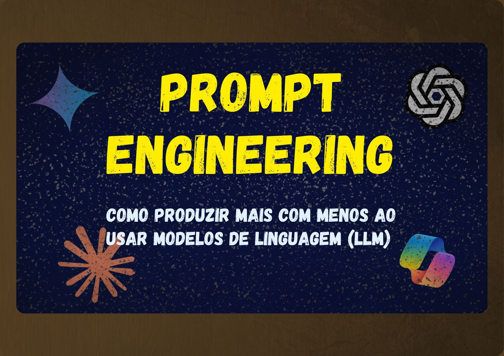
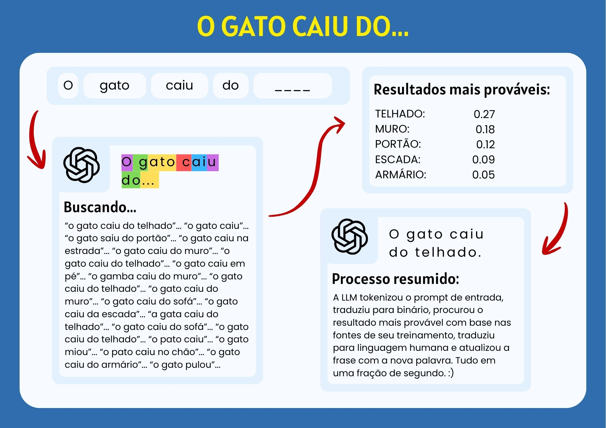
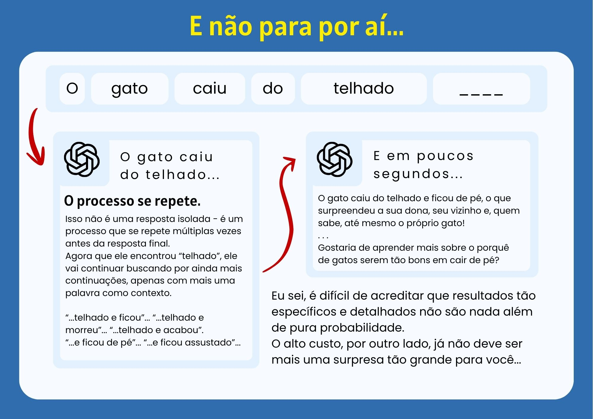
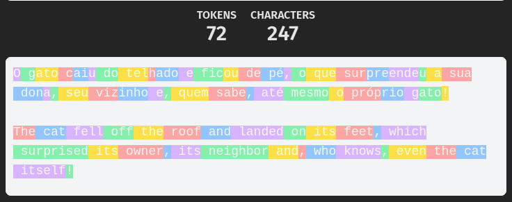
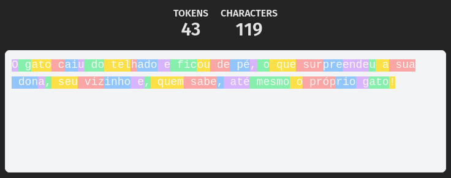

# Prompt Engineering - Como aumentar a produtividade e reduzir custos ao usar LLMs

As LLMs surgiram há poucos anos, mas já têm causado mudanças massivas na forma como trabalhamos. Contudo, a essa altura do campeonato, uma coisa já ficou clara:

LLMs são caras. Muito caras.

Há casos em que empresas e pessoas adotaram IA com o objetivo de reduzir custos e, ironicamente, acabaram pagando mais caro do que gastariam com profissionais humanos.

Um dos maiores problemas para isso está no uso de LLMs para tarefas nas quais elas apresentam limitações, além do uso ineficiente de recursos em tarefas, mas eu quero ir mais longe.

Essa série, dividida em dois artigos, será um manual completo de como produzir mais e em menos tempo ao usar LLMs. Para isso, vamos abordar os seguintes temas:

- O que são LLMs, como interpretam seu prompt e como formulam respostas.
- Como melhorar os seus prompts visando economia de tokens e resultados mais precisos.
- (parte 2) Como obter resultados específicos, tais como aleatoriedade, comunicação humana convincente, entre outros objetivos comuns ao usar LLMs.
- (parte 2) Diferenças entre algumas das LLMs mais conhecidas (e quando usar cada uma delas).

Com nosso objetivo esclarecido, vamos começar pelo básico.

## O que são LLMs e como processam informação

Para explicar o que são LLMs de forma completa, primeiro precisamos explicar o que é Inteligência Artificial (AI), Aprendizado de Maquina (ML) e Inteligência Artificial Generativa (GenAI). Dessa forma, além de conseguirmos explicar o termo com detalhes desde a base, evitamos ainda tratar outros conceitos semelhantes como sinônimos absolutos. 

 
<small>Representação visual em conjuntos da relação entre AI, ML, GenAI e LLM.</small> 

Inteligência Artificial é um ramo da tecnologia que busca imitar a inteligência humana e que, dentre outros, tem o Aprendizado de máquina como um meio para esse fim.

Aprendizado de Máquina (ou Machine Learning) é um ramo da área de Inteligência artificial que busca imitar a inteligência humana com um sistema de aprimoramento baseado em dados. Em vez de definir manualmente todas as regras necessárias para executar uma tarefa, no Aprendizado de Máquina definimos um modelo e um processo de treinamento baseado em dados, permitindo que, a partir da identificação de padrões, ele alcance um resultado esperado.

Inteligência Artificial Generativa (ou Generative AI) é um subcampo do Aprendizado de Máquina que busca criar (ou gerar) conteúdo, como texto, imagens e sons a partir dos dados usados como treinamento.

Por fim, Grande Modelo de Linguagem (ou Large Language Model) trata-se de um modelo de inteligência artificial generativa de grande escala que foi treinada com foco em linguagem humana e, por isso, hoje é capaz de gerar e manipular linguagem de forma bastante fiel, produzindo textos e realizando diversas tarefas relacionadas à linguagem.

Agora, com todo esse contexto, fica fácil de entender como LLMs funcionam. Elas não entendem e reproduzem linguagem humana como nós - Elas reconhecem padrões.

Para o prompt de entrada, ela analisará o texto em busca de informações que servirão de contexto para a resposta, como padrões de escrita, problemas a serem resolvidos, tarefas a serem realizadas, detalhes específicos, entre outros. Para a saída por outro lado, a tarefa é um pouco mais específica.

Imagine uma frase simples sendo processado por uma LLM: "O gato caiu do...".

O modelo não entende o que é um gato ou o conceito de cair, ele quebra as palavras em subconjuntos de caracteres chamados tokens e procura por padrões semelhantes aprendidos durante o treinamento.

 
<small>Processo extremamente simplificado sobre a geração de resposta por LLMs.</small> 

E que fique claro, essa não é uma simples tarefa específica de "complete a frase", esse é o processo padrão de resposta da LLM. Cada palavrinha que você lê como resposta à um prompt é esse mesmo processo acontecendo centenas, senão milhares, de vezes por segundo.

 
<small>Continuação do processo extremamente simplificado sobre a geração de resposta por LLMs.</small> 

Para gerar um parágrafo a partir de "o gato caiu do...", a LLM precisa processar uma quantidade incontável de relações aprendidas em seu treinamento para chegar a candidatos que podem ser usados como continuação da frase. Porém, conforme vamos especificando o resultado que queremos, como ao dizer "o gato não pode morrer" ou "o gato não tem dono" nesse exemplo, os resultados válidos que podem ser usados para completar a resposta vão, aos poucos, sendo reduzidos, o que pode ser refletido na qualidade da resposta.

Com tudo isso explicado, fica claro que não podemos pedir coisas às LLMs como se fossem gênios mágicos. Cada frase que você adiciona ao seu prompt tira uma pilha de opções de resposta e adiciona outra no lugar, sendo que se você tirar demais, o resultado será falho. Por isso, é necessário fazer o possível para manter apenas as opções que fazem sentido para o seu objetivo. 

## Como melhorar os seus prompts para obter resultados mais precisos e economizar tokens

Vamos começar esclarecendo o que é um token. Na imagem 2 da seção passada, nós dividimos a frase "o gato caiu do..." de uma forma peculiar. Não dei muitas explicações quanto a divisão naquele momento pelo bem do aprendizado, mas cada uma daquelas divisões é um token. Você também pode ver mais conversões de palavras em tokens na imagem abaixo:

<small>Conversão aproximada de texto para tokens. Nesse caso, a frase com 119 caracteres foi convertida em 43 tokens.</small> 

LLMs não entendem texto da mesma forma que nós, humanos. Por isso, uma vez que cada idioma pode chegar a ter dezenas de milhares de palavras, nem sempre há beneficio real para um modelo em atribuir significado a palavras completas. Por outro lado, se basear apenas em caracteres pode acabar dando informações insuficientes sobre a nossa linguagem e dificultar a procura por padrões. Nesse contexto, os tokens se tornam um meio termo ideal.

Mas isso é apenas uma curiosidade. Se preocupar em usar palavras específicas para economizar tokens em cada prompt é, no mínimo, uma prática contraproducente. Por isso, vamos nos apegar a generalização de que 100 tokens equivalem a aproximadamente 75 palavras e seguir para os problemas mais graves.

### Falta de Contexto

Estamos falando de modelos com uma quantidade imensurável de conhecimento. Para um humano, é intuitivo ler a frase "o gato caiu do..." e pensar imediatamente em apenas uma ou duas palavras que completem a frase de forma lógica. Porém, é provável que existam diferenças entre as palavras que você pensou e as que outros falantes de português pensariam.

Uma LLM chega em todas essas palavras de uma vez e, sem qualquer norte quanto a qual das opções você quer (já que não foi especificado), tudo o que ela pode fazer é escolher uma das opções mais genéricas para aumentar as chances de acerto.

Para evitar esse problema, você precisa dar mais contexto a ela. Aqui vão algumas formas de fazer isso:

#### Defina uma persona
Quando você fala com uma LLM de forma genérica, ela aborda a tarefa de forma genérica. Se você pede, por exemplo, para que o ChatGPT "otimize essa função", ele pode tentar corrigir bugs, otimizar o desempenho, melhorar a legibilidade ou mesmo todas as opções ao mesmo tempo. Uma forma de resolver esse problema é definir um persona com um prompt semelhante a "Você é um especialista em otimização de performance que escreve código limpo e escalável..." ou "sob a perspectiva de um especialista em otimização de performance que escreve código limpo e escalável..." antes de contextualizar a tarefa. Dessa forma, com poucas palavras, você não define apenas o objetivo a ser cumprido, mas sob qual perspectiva ele deve ser realizado.

#### Contextualize o cenário
Seguindo o exemplo anterior de otimização de funções, mesmo definindo um Persona, ainda estamos deixando uma margem muito grande para erro quando descrevemos apenas a tarefa a ser realizada. Imagine dois e-commerces de um nicho semelhante, o primeiro pertence a uma empresa multinacional com mais de 500 produtos diferentes cadastrados enquanto o segundo pertence a uma microempresa artesanal com menos de 20 produtos únicos. Para o primeiro caso, essa função deve ser otimizada com grande foco em escalabilidade e organização para facilitar buscas. Para o segundo caso, o foco deve ser uma organização bem mais simples com uma atenção maior em cada produto de forma individual. A tarefa é a mesma, mas o objetivo muda completamente a depender do contexto em que está inserido.

#### Descreva a tarefa
Esse é o mais óbvio, mas que não deve deixar de ser mencionado. As dicas anteriores ajudam muito, mas se a sua tarefa for simplesmente "otimize a função", o resultado ainda pode deixar a desejar. Perguntas como "o que a função faz", "com quais outras funções ela se relaciona" e "por que essa função existe no contexto do projeto" são alguns exemplos de detalhes sobre os quais a LLM precisa para responder de forma adequada nesse exemplo. As vezes é possível obter esses detalhes através do código copiado, como no caso de uma função muito bem escrita ou com código extra adicionado como contexto. Ainda assim, é preferível que o objetivo esteja definido de forma objetiva em vez de presumir que o código é claro o bastante.

#### Defina restrições
LLMs amam fazer mais do que o pedido e tomar decisões por conta própria, o que pode surgir tanto como uma decisão de arquitetura desnecessária quanto como comentários desnecessários ou textos excessivamente descritivos. Parte desse problema costuma ser mitigado por algumas das práticas já mencionadas, mas separar um parágrafo apenas para exigir "não adicione componentes à classe", "não adicione comentários desnecessários" ou "responda apenas com o código completo atualizado" costuma consumir bem menos tokens do que poupa.

#### Use exemplos
Lembre-se que LLMs são ótimas identificando padrões, então quando for difícil descrever com palavras o que é um bom resultado, use exemplos. Um exemplo é ótimo para transmitir sintaxe e estilo de comunicação de preferência, enquanto dois ou três podem ser usados para definir estrutura acerca de temas mais complexos e diversos.

### Excesso de Contexto

LLMs contém uma quantidade imensurável de conhecimento. Ainda assim, esse conhecimento não é infinito. Voltando ao exemplo "o gato caiu do...", imagine que você comece a descrever que "o gato não pode morrer na história", "o gato se chama bernardo", "o gato tem uma perna machucada e não pode cair de locais muito altos", "o gato é siamês e têm o costume de miar quando está com fome ou quer atenção"... O problema é que se você escrever demais, vai acabar com um contexto tão específico que o modelo não será capaz de encontrar conteúdo correspondente para continuar uma resposta que respeite todas as condições de uma forma fiel. Como resultado, a LLM pode não saber exatamente qual parte do prompt é a mais importante ou mesmo inventar algo para manter a coesão do texto.

Vale lembrar que esses modelos são baseados em estatística: Eles não sabem se o que eles estão falando realmente faz ou não sentido, então quando algo falha e a LLM alucina, o resultado sai com a mesma confiança de sempre.

Para evitar esse problema, você precisa evitar que seus pedidos se tornem muito grandes com informações excessivas, irrelevantes ou conflitantes. Aqui vão algumas formas de fazer isso:

#### Seja direto
Evite encher seu texto de palavras sem significado bem definido. Prefira termos diretos como "Faça" ao invés de "gostaria que você fizesse", "basicamente", "relativamente" etc. Embora possam parecer úteis, essas palavras não definem nada de forma precisa, e logo, só serve para confundir o modelo. Uma forma simples de revisar o prompt é verificar se frases muito longas contêm informações redundantes, vagas ou que poderiam ser separadas em instruções mais claras.

#### Refine seus prompts
É normal não conseguir gerar um prompt bom de primeira. As vezes, só percebemos que um detalhe era importante quando a LLM falha justamente naquele ponto, ou então percebemos que o prompt foi longo demais quando notamos uma especificação que foi completamente ignorada. Felizmente, LLMs são ótimas escrevendo prompts para elas mesmas. Por isso, sempre que possível, peça para que modelos de IA leiam e melhorem seus prompts, sempre seguindo as demais práticas já mencionadas, claro.

#### Divida suas entradas
LLMs possuem um limite para a quantidade de tokens que podem ser processados em um determinado contexto, então se o seu prompt for muito longo ou exigir uma resposta muito extensa, é provável que o modelo ignore alguns detalhes ou não tenha tokens o bastante para cobrir todas as especificações. Por isso, se precisar cumprir uma tarefa muito longa, o ideal é dividi-la em tarefas menores. Dessa forma você não só mantém um maior controle sobre cada etapa, mas também garante um resultado mais robusto.

#### Prompt de cadeia de pensamento
Uma prática comum na engenharia de prompts é a chamada Chain-of-Thought Prompting. A ideia é começar perguntando algo como "Explique em um curto parágrafo o conceito de inteligência artificial" para apenas depois perguntar, por exemplo, "como a IA influencia no mercado de trabalho atual". Na prática, ao invés de começar por descrever o que é inteligência artificial para evitar confusões ou pedir por muitas coisas de uma vez, você pede para que ela faça essa definição e considere esse contexto para respostas futuras. Isso pode facilitar a execução e a verificação de tarefas complexas, pois permite trabalhar com etapas menores, preservando a qualidade de cada resposta individual e evitando contextualizações longas para temas que você pode não dominar.

### Entenda e Aceite os Limites das LLMs

#### LLMs não são fontes confiáveis
Estruturalmente falando, LLMs não sabem quando erram. Não há como saber. As chances disso acontecer são maiores para conteúdo com pouca informação específica disponível, mas também pode acontecer para conteúdo mais bem distribuído. Por isso, não invente. Teste o código gerado, revise o conteúdo pesquisado e, sempre que possível, peça para que o modelo deixe as fontes usadas na pesquisa. Essa é a melhor forma de garantir a veracidade da resposta.

#### LLMs não são determinísticas
Sei que essa afirmação soa estranha, afinal passamos o artigo inteiro explicando como LLMs se baseiam em probabilidade. Porém, na hora de decidir a palavra que melhor se encaixa para continuar uma frase, esses modelos nem sempre escolhem o termo com maior possibilidade de uso, o que pode acarretar em variações de resposta mesmo quando um mesmo prompt é enviado por uma mesma pessoa. Embora esse comportamento possa ser modificado com um pouco de configuração, esse não costuma ser o comportamento padrão da maioria das LLMs.

#### Dê espaço para erros
LLMs frequentemente sabem de algo que você não sabe, o que significa que uma instrução que parece óbvia para você pode ter uma série de implicações que precisam de especificação. Por isso, para evitar que ela tente te responder com informações necessárias faltando, peça por um feedback. Uma mensagem como "peça por mais detalhes se necessário" ou "se restarem dúvidas, me avise antes de desenvolver qualquer coisa" são ótimos exemplos disso. IAs fazem apenas o que você pede, então se você não especificar que ela pode, inclusive, não responder, ela pode preferir retornar um resultado ruim à dizer que faltam informações.

#### Peça ou forneça fontes
mesmo com todas as dicas acima, LLMs continuam agindo com base em probabilidade. Por isso, para evitar delírios, peça fontes ou, se possível, forneça você mesmo fontes consideradas confiáveis.

De forma geral, o objetivo de um bom prompt é garantir contexto suficiente sobre a meta a ser atingida para evitar respostas vagas, generalistas ou básicas demais, e ao mesmo tempo não restringir demais o resultado esperado para evitar respostas falhas, imprecisas ou mesmo falsas. Além disso, também devemos entender a natureza das LLMs para que não repassemos tarefas que podem nos soar simples, mas que são muito mais complicadas para um modelo sem real capacidade de raciocínio.

### Economize Tokens

Todas as práticas já mencionadas, direta ou indiretamente, economizam tokens. Lembre-se que o objetivo final é garantir uma entrega útil para você ou a empresa em que você trabalha, então no fundo, a maior economia é concluir a tarefa estipulada sem ausências ou excessos. Ainda assim, existem algumas outras práticas que você pode usar para orientar o comportamento de um modelo.

#### Especifique
Quando se conversa com uma LLM, você precisa tomar cuidado com as palavras. Dizer "analise esse documento de 30 páginas e explique o parágrafo sobre Rescisão de contrato" pode soar intuitivo para um humano: A tarefa é encontrar o parágrafo sobre Rescisão de contrato e explicar ele. Uma IA generativa, por outro lado, poderia interpretar: A tarefa é analisar TODO o documento de 30 páginas, encontrar o parágrafo sobre Rescisão de contrato e, por fim, explicá-lo. Parabéns! Você acabou de fazer o modelo consumir 29 páginas de tokens de entrada de forma desnecessária. :)

Uma forma de evitar isso é ser específico e filtrar a informação útil antes de pedir qualquer coisa. Nesse exemplo, começar o pedido por "Busque a cláusula de rescisão de contrato nesse documento de 30 páginas..." é bem mais claro e evita a execução de tarefas desnecessárias.

#### O token de saída é mais caro
Desconsiderando os casos específicos em que você precisa colar documentos inteiros de 30 páginas, o token de saída é a sua principal preocupação. Em muitos serviços, tokens de saída são significativamente mais caros do que tokens de entrada. Por isso, vale muito mais a pena determinar no prompt de entrada "Responda em até 50 palavras" ou "Responda de forma objetiva. Quero apenas a informação sem detalhes adicionais" do que permitir a geração de parágrafos inteiros de explicação quando você pretende ler apenas um "Sim" ou "Não" e ignorar todo o resto.

#### Contexto acumulado
Como já abordamos ao falar de Chain-of-Thought Prompting, em uma conversa com histórico, o sistema pode incluir mensagens anteriores no contexto enviado ao modelo. Isso pode ser muito vantajoso quando queremos tratar de apenas um tema, mas muito maléfico quando acumula informações desnecessárias que continuam sendo processadas. Para evitar esse tipo de problema você pode adotar diferentes medidas. Para perguntas simples, crie uma nova conversa e a delete assim que terminar. Para assuntos mais específicos onde o histórico da conversa for importante para análises futuras, instrua o modelo a resumir o contexto anterior quando for tratar de um tema ligeiramente diferente.

#### Documente seus prompts
Quando um prompt detalhado conduz um processo completo e é usado com frequência em seu projeto, ele deixa de ser algo pontual e passa a fazer parte do seu fluxo de engenharia, devendo inclusive ser incluído em seu sistema de versionamento. Sem exagero. Quando você escreve o prompt pela primeira vez, a resposta apresenta falhas que precisam ser corrigidas manualmente, mas se você toma isso como experiência, melhora o prompt inicial e o salva de alguma forma, você permite o aprimoramento constante do prompt com direito a auxílio do restante do time e backup caso uma versão nova piore o resultado. Isso te salvará muito tempo nos usos seguintes que vão, aos poucos, apresentar menos problemas.

#### Prompt caching
Como Benefício adicional, embora mais avançado, temos ainda uma técnica conhecida como Prompt Caching que se beneficia dessa prática. Ao usar parágrafos com sintaxe idêntica para contextos e instruções comuns entre diferentes tarefas, uma LLM pode apenas reutilizar um processamento anterior que utilize o exato mesmo conjunto de tokens, o que pode reduzir significativamente o custo e a latência associados ao processamento dessas partes repetidas do contexto.

#### Diferenças de idiomas
Em seu treinamento, as LLMs mais conhecidas, como Claude, Gemini, ChatGPT e Copilot, consomem em sua maioria conteúdo na língua inglesa, o que interfere diretamente na forma como tokens são processados. Observe o exemplo da imagem abaixo:

<small>Conversão aproximada, realizada por tokencounter.org, de texto em português e inglês para tokens no modelo gpt-4. Nesse caso, as palavras em inglês são, em geral, bem menos subdivididas.</small> 

Enquanto na língua portuguesa palavras são frequentemente divididas em dois, três ou ainda mais tokens, na língua inglesa a proporção é próxima de 1 token por palavra. Isso significa que ao escrever e obter respostas em inglês, você economiza aproximadamente 0,5 tokens por palavra, o que é muita coisa. Ainda assim, ressalto que a melhor economia é sempre a do tempo levado para realizar a tarefa com sucesso, então é preciso analisar as circunstâncias com calma antes de decidir mudar o idioma que você usa para interagir com uma LLM.

## Finalização

Ainda há muito que quero falar sobre produtividade com LLMs, o que inclui dicas especiais para as ferramentas mais conhecidas e formas de obter resultados específicos com LLMs, mas para separar melhor os temas e evitar artigos muito extensos, vou deixar para fazer isso em um próximo artigo no mês que vêm.

Se você está lendo esse artigo próximo a data de lançamento, recomendo que assine a newletter "Torne-se um Programador Melhor" para ser avisado quando a parte dois sair. Caso contrário, assine mesmo assim! :D 
Trago quinzenalmente conteúdo técnico variado para quem quer aprender algo que vá além dos cursos mais comuns da área de programação.

No mais, obrigado por ler até aqui e até a próxima! ;)

### Créditos

**O que são LLMs:**
- https://www.linkedin.com/pulse/demystifying-ai-complete-beginners-guide-cedric-strickland-oiunc/
- https://cloud.google.com/learn/what-is-machine-learning?hl=pt-BR
- https://ibrahimcesar.cloud/blog/como-llms-funcionam-do-texto-ao-token/
- https://blog.nvidia.com.br/blog/como-obter-melhores-resultados-do-seu-grande-modelo-de-linguagem/

**Engenharia de prompts:**
- https://imasters.com.br/inteligencia-artificial/desvendando-a-comunicacao-com-llms-o-poder-da-engenharia-de-prompts
- https://kodus.io/boas-praticas-prompt-engineering/
- https://www.redhat.com/pt-br/blog/tips-for-gen-ai-prompts

**Economia de tokens:**
- https://www.glukhov.org/pt/llm-performance/cost-effective-llm-applications/
- https://chatjuridico.com.br/economia-de-tokens-skill-que-reduz-custo-ia-advocacia/
- https://medium.com/@michael.hannecke/llm-prompt-caching-what-you-should-know-2665d76d3d8d

**Site de conversão de texto para tokens:**
- https://tokencounter.org/